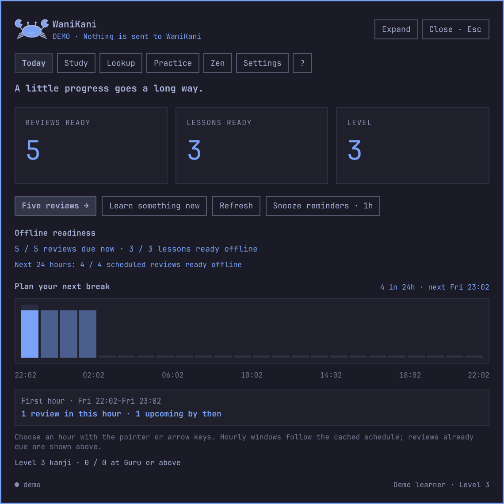

# WaniKani for Omarchy

**Five reviews, then back to work.**

A native WaniKani study companion for Omarchy 4: lessons, reviews, listening practice, offline sessions, selection lookup, an ambient kanji gallery, and a little crab. The interface follows your desktop theme. There is no browser wrapper, cloud backend, telemetry, or AI grading.

This is an independent community client, not a Tofugu product. **Version 0.2.8 is a development release.** Live-account study qualification and two weeks of personal daily use are still pending before a contest-ready 1.0.



The same lookup follows [Tokyo Night](docs/screenshots/lookup-dark.png) and [Flexoki Light](docs/screenshots/lookup-light.png). See the [kanji gallery and companion](docs/screenshots/zen-dark.png). These are captures of the installed plugin, using independently authored demo content.

The reading trail can also turn words from an explicitly selected Japanese passage into a chosen ungraded practice batch. Select up to twenty cached words, check their readiness, and return to the exact passage from study. Saved lessons and reviews remain intact; replacing an earlier ungraded practice batch is a separate, explicit action. See [practice from a passage](docs/TRAIL_PRACTICE.md).

## Install

The current development installation is a Git clone of the local workspace repository. Its `origin` points to that workspace, not to a public GitHub repository. No public repository or contest submission has been published.

Install or update with the desktop unlocked and study closed. This machine’s [lock/reload incident](docs/LOCK_RELOAD_INCIDENT.md) currently defers installed verification.

The repository root is a valid Omarchy plugin. To install a committed local checkout, run `omarchy plugin add /absolute/path/to/omarchy-wanikani --enable`. After publishing a reviewed copy to your Git host, use its repository URL in the same command. Keep private account state outside the repository; do not copy your state or keyring into a release.

Runtime requirements are Omarchy 4.0.2+, Quickshell 0.3.1+, Python 3.11+, Qt Multimedia, and a Japanese font (Noto Sans CJK JP recommended). `wl-paste` powers explicit selection lookup; `secret-tool` provides optional secure persistence.

Open the crab in your bar. Choose **Try the demo** to explore without an account, or open Settings to connect a WaniKani personal API token. Read-only tokens support lookup and progress; native study needs assignment-start and review-create permissions. Editing notes and synonyms also needs study-material create/update permissions. The token is passed over private process pipes and stored only in your desktop keyring when available. Session-only mode works when the keyring cannot store it.

Settings includes **Install shortcuts & launchers** and **Remove shortcuts & launchers**. From the installed plugin directory, the same optional setup is available with:

```sh
python3 tools/integrate.py check
python3 tools/integrate.py install
```

This adds Study and Lookup launchers and available shortcuts, backing up your bindings. It preserves shortcuts that are already occupied.

| Action | Shortcut / command |
|---|---|
| Study or resume | Super+Alt+W |
| Look up selected text | Super+Alt+Shift+W |
| Check / continue | Enter |
| Save and return to work | Escape |
| Dashboard | `omarchy-shell wanikani dashboard` |
| Reviews / lessons | `omarchy-shell wanikani reviews` / `omarchy-shell wanikani lessons` |
| Meaning listening / level progress | `omarchy-shell wanikani listen` / `omarchy-shell wanikani progress` |
| Kana dictation | `omarchy-shell wanikani dictation` |
| Lookup / Zen | `omarchy-shell wanikani lookup` / `omarchy-shell wanikani zen` |
| Refresh / status | `omarchy-shell wanikani refresh` / `omarchy-shell wanikani status` |
| Settings / saved submissions | `omarchy-shell wanikani settings` / `omarchy-shell wanikani recovery` |
| Practice library / help | `omarchy-shell wanikani practice` / `omarchy-shell wanikani help` |
| Keyboard help | F1 |
| Panel navigation outside text fields | Ctrl+1 Today, Ctrl+2 Study, Ctrl+3 Lookup, Ctrl+4 Zen, Ctrl+5 Settings, Ctrl+6 Practice, Ctrl+7 Listen, Ctrl+8 Progress, Ctrl+9 Activity |
| Enter / leave demo | `omarchy-shell wanikani demo true` / `omarchy-shell wanikani demo false` |

Shell payloads also work: `omarchy-shell shell summon io.github.lostandadrift.wanikani '{"view":"reviews","limit":5}'`. Supported views: dashboard, review-overview, lesson-overview, progress, activity, listen, dictation, reviews, lessons, practice, practice-library, resume, lookup, zen, settings, help, recovery. Direct practice accepts `subjects:[1,2]`; practice-library opens the selection view. Lookup accepts `selection:true` or `text:"山"`.

For scripts and agents, `python3 tools/wanikani.py status --json` returns a versioned aggregate status and `doctor --json` checks local dependencies and shell integration, with cached offline-readiness, synchronization, cache and recovery guidance. It does not initiate a refresh or a media check. The helper can open an overview or deliberately begin study; it never supplies answers. See [agent and command-line support](docs/AGENT_SUPPORT.md) for commands, privacy boundaries, exit codes, and recovery guidance.

For a learning recap, `report` reads cached totals for the last seven local calendar days; `--days 30` selects thirty days:

```bash
python3 tools/wanikani.py report
python3 tools/wanikani.py report --days 30 --json
```

The report separates completed review, lesson and practice cycles, listening self-assessments, kana dictation results and typo corrections. It includes its own calculation timestamp and retained-local-records scope; these totals are not server confirmations or activity from other devices. Missing totals stay unavailable, and stale or incomplete data is labeled. Each report makes one read-only status call; it does not refresh the account, scan history, open a view or start study. See [cached learning reports](docs/AGENT_SUPPORT.md#cached-learning-reports) for freshness and count definitions.

An optional [agent playbook](skills/omarchy-wanikani/SKILL.md) ships in the repository. Point your agent to it for status checks, learning views, requested study starts, and recovery guidance through the helper. Installing the Omarchy plugin does not register this skill globally. The playbook preserves your requested scope and keeps answers, credentials, and private database contents out of routine agent support.

## How study works

**Reviews** and **Lessons** have separate overview screens and independently saved sessions. Today shows both actions and any saved position. Switching between them preserves the current question, draft and mistake counts for each. Direct commands still start or resume their requested mode.

The lesson overview lets you browse confirmed unlocked subjects by type, preview the recommended batch, or choose 1–20 subjects yourself. Previewing does not start a lesson. A saved lesson session always resumes its existing selection and position. Discovery then follows **Meaning → Reading or Sound → Context**, with only applicable steps and a separate **Start lesson quiz** action. Closing keeps your exact step and reopening stays silent. See [guided lessons](docs/GUIDED_LESSONS.md) for navigation, audio and recovery behavior.

**Activity** shows the last seven or thirty local calendar days of completed subjects, finished batches, separate meaning-listening and kana-dictation results, and guarded typo corrections. Current submission confirmations and items needing attention remain separate. Suggestions open the appropriate overview without starting study. Records retained across an account reset still describe work you did here; activity from other devices is not reconstructed.

**Progress** shows confirmed first passing toward the current level’s 90% kanji requirement, pending submissions separately, current SRS distribution, and a paged level board with prerequisites and known review times. Incomplete account data is labeled explicitly. Unrevealed subjects in unfinished graded work stay protected on the board.

Choose **Level history** within Progress for account milestones, separate recorded visits after resets, elapsed calendar durations and expandable dates. Passing a level stays distinct from burning all its subjects. Older API history may be missing even after a complete sync. [History scope and behavior](docs/LEVEL_HISTORY.md)

Vocabulary pronunciation has visible replay/stop and download/error states. An explicitly requested recording can download without holding up answers. Settings includes separate lesson/review autoplay and **Test selected voice**, using a safe learned sample. A downloaded alternate voice remains usable when the preferred voice is missing offline. Recordings stop when the surface, subject, account or study question changes.

Kanji reading and context pages offer **Hear this kanji in a word**: up to three original whole-vocabulary recordings, with the written word, actual pronunciation, meaning and offline availability. New vocabulary is labeled as a preview, and unfinished graded items stay protected. Open and play examples explicitly; they do not start lessons or change grades. See [kanji audio examples](docs/KANJI_AUDIO.md).

**SRS explorer** connects the Progress counts to subjects across all accessible levels. Open Apprentice, Guru or another group, then refine by subject type, level and exact stage. Order by level or confirmed next-review time. **Back to progress** restores your filters and page after reading a subject or editing notes. Saved graded answers remain protected, and pending reviews keep their confirmed stage until synchronization. Partial cached totals are labeled. See [SRS explorer](docs/SRS_EXPLORER.md).

**Listen** offers five familiar words using cached WaniKani pronunciation. The first side has only audio; reveal the word, meanings, and readings before choosing **Got it** or **Again**. Listening has its own local intervals and saved session, with five new listening words per day. It never submits a WaniKani review or changes your account schedule. Undo can revise the last local rating; playing or revealing a new word still counts toward that day's exposure limit. Words in unfinished graded work stay protected. By default, words due on WaniKani within 24 hours are also excluded. Autoplay follows explicit practice actions; returning to a saved session stays silent.

**Type kana** is a second activity inside Listen. Play a familiar cached recording, type what you heard in romaji or kana, then check against that exact recording’s pronunciation. The word stays hidden until Check. Matched readings and words to revisit get local intervals only after Continue; Skip records no correctness result and changes no interval. Undo restores the last committed result. Dictation has its own saved draft, batch and five-new-words daily allowance, separate from meaning listening. Replay and resume keep the same recording; opening or returning stays silent. See [kana dictation](docs/DICTATION_PLAN.md) for input, hearing and recovery details.

When eligible recordings are missing, Listen offers **Prepare recordings** for a batch of up to five. This explicit download shows aggregate progress while keeping the words hidden. It respects your content access and media budget, and does not start a session, play audio, or use the daily listening allowance. **Cancel preparation** stops further downloads; completed cache files remain usable. Choose **Start listening** when you are ready. Preparation is available in the native Listen view; the CLI can open that view but cannot start the download.

Sessions contain five subjects by default. Lessons introduce the subjects before their quiz. Reviews test each required part; wrong answers retain their mistake counts until the subject is finished. Romaji converts to kana locally, and existing Japanese input methods are supported.

**Require exact meanings** in Settings disables automatic spelling tolerance while keeping accepted variants, saved synonyms, and distinct retryable input mistakes. Readings always require exact normalized kana. Conservative grading preserves quantities and negation, and incomplete answer data cannot enter study.

**I made a typo** is available only on the current incorrect feedback screen. Corrections are recorded locally. A finished subject enters the submission queue only after you acknowledge its last feedback screen. Already committed WaniKani progress is never retroactively overridden.

After a batch, **Review this batch** shows each subject’s recorded mistakes and current local submission status. **Practice items to revisit** starts ungraded practice of missed items; guarded typo corrections are excluded. Back to work remains the primary action.

See the native [batch recap](docs/screenshots/recap-dark.png) and [practice selection](docs/screenshots/practice-dark.png), captured with authored demo subjects.

Escape preserves the exact session, draft answer, and question. Expand changes the presentation without restarting. Practice is ungraded and never changes your account's schedule. You can practice independently while a graded session is paused; Resume returns to that saved graded session first.

Japanese prompts fit the available space without cutting off long vocabulary. Image radicals keep their meaning hidden until the appropriate reveal.

Lessons group the meaning, reading, and example sentences clearly. Saved personal notes appear beside the relevant mnemonic, including after a mistake. Feedback shows only the part you just answered.

**Tell them apart** opens a side-by-side comparison of similar kanji, with large characters and the relevant meanings or readings. It uses WaniKani’s [visual-similarity links](https://docs.api.wanikani.com/20170710/#kanji); inaccessible content and subjects in unfinished graded work stay out of the comparison. This is a study aid and never changes your grades.

See the native [lesson comparison](docs/screenshots/comparison-dark.png) and [quiet recall](docs/screenshots/quiet-recall-dark.png), captured with independently authored fixtures.

The **Practice** library groups saved difficult items, recent mistakes, and learned subjects. Choose up to twenty, or add five at a time. It shows why each subject appears and whether required content is cached. An explicitly selected practice session keeps earlier local records and the paused graded session intact. Current graded answers remain hidden on library cards.

Lookup accepts romaji readings as well as Japanese, meanings, and personal synonyms. Type and progress filters narrow the accessible catalogue. Exact matches rank first; longer selections surface known words contained in the text. Lookup never sends selections to a translation service.

**Words in your selection** turns a short Japanese passage into a local reading trail. Select a highlighted word or a word button to inspect it, then return to the same passage. Overlapping vocabulary remains available as separate matches. The trail preserves spaces, newlines, and rare kanji; selections longer than 256 characters show a clear limit notice. Eight word buttons appear initially, with a control to show the rest. Pending and uncertain work have explicit status labels. Trail links keep unfinished graded subjects closed; ordinary deliberate catalogue lookup remains available. See the [native reading trail](docs/screenshots/reading-trail-dark.png), captured with an authored passage.

Notes and synonym drafts survive closing, navigation, and restart, including unfinished commas. **Save notes & synonyms** applies them to study and queues synchronization; **Discard draft** restores the saved version. Unsaved synonyms never count as answers. You can keep drafting while an earlier save waits to sync, and a delayed Save or Discard cannot erase newer input.

**F1** opens keyboard help. Navigation shortcuts leave text fields and IME composition alone, focused controls scroll into view, and holding Enter cannot check an answer and immediately skip its feedback.

## Offline behavior and recovery

Subject text is cached for your accessible levels. Media is downloaded incrementally, with up to 40 new assets per sync and a configurable disk limit. Image-only radicals require their image before they can be quizzed. Audio availability is shown explicitly.

When the media cache is full, required images for active study and upcoming work take priority over optional audio and distant subjects. Existing usable images and voice clips stay available while replacements download. The Practice library checks the displayed page's offline availability and labels that count, keeping large learned catalogues responsive.

Settings lists pronunciation voices from the accessible cached catalogue. A preferred voice uses its downloaded clip when available, falling back to another downloaded voice for that word. Missing voice metadata does not discard your preference.

The dashboard and Settings show offline readiness for reviews due now, lessons, and reviews scheduled in the next 24 hours. Required text/images are checked separately from optional audio, including whether subscription access will cover each scheduled review. Availability checks run in the background, and synchronization reports its current stage. Resuming saved work reads the latest durable question and draft immediately. New online study refreshes account state first and defers optional media downloads. Reconnection triggers a coalesced refresh through the shell’s shared networking service; ordinary suspend does not invalidate the offline clock.

Cached lessons and due reviews work offline. Completed work stays pending until confirmed. A pending subject cannot enter another graded cycle, and subsequent scheduling/unlocks wait for WaniKani's response. Subscription access and known expiry dates still apply offline.

The API does not provide idempotency keys or retrievable individual review history. A timed-out submission is **uncertain**, never automatically retried. Refresh reconciles it against remote progress. When another client has changed the assignment, its state wins and the local answer remains recorded. The **Saved submissions** page shows paginated local records, error counts, and the reason a result is waiting or needs attention. Filter reviews, lessons, or note edits; inspect confirmed and archived records separately. An explicit recovery action lets you keep remote progress and archive an unresolved local result. This recovery path deliberately offers no force-resubmit button.

Activity charts show only completed subjects and practice recorded by this plugin. They do not reconstruct your all-device review history.

Demo Settings includes **Simulate offline in demo**, **Reconnect demo & sync**, and **Reset demo progress**. This exercises pending submissions using authored fixtures without changing the computer's network connection or contacting WaniKani. It is a demonstration aid; real network recovery is tested separately with a mock API and must still be qualified on a live account.

## Desktop behavior

The bar shows due items, pending work, or the next-review countdown. **Study rhythm** in Settings offers reminders when reviews become due, at chosen local times, or at intervals within a daytime window. Choose reviews, listening, or both, then preview and apply the schedule. Defaults use a two-hour minimum, three reminders per day, and quiet hours of 22:00–08:00. Snooze or skip today without changing your schedule. All invitations share one budget and respect Do Not Disturb, lock, fullscreen, vacation, and active study. Suppressed reminders are not replayed later.

The dashboard offers a small, dismissible celebration when synchronization confirms a new account level. The first connection establishes a baseline; local offline results do not invent milestones. Companion animation respects reduced motion.

**Plan your next break** lets you inspect each hour of the next day’s cached review schedule. Hover, tap, or use the arrow keys to see the local time, reviews arriving in that hour, and the cumulative upcoming total. Reviews already due remain separate.

Desktop and idle kanji displays are optional. The desktop card appears after ten seconds without activity. They show learned subjects not due in the next day, stop on activity/fullscreen/study/lock, and give way before Omarchy's configured screensaver deadline. Automatic idle gallery display respects Omarchy's stay-awake mode and disables itself when the configured interval is too short. The plugin never owns or changes your system lock. Companion animation and reduced motion have separate controls.

Manual Zen works with both automatic displays switched off. Ambient catalogue requests run only while a display or an opened Zen view needs them; study and hidden surfaces avoid that background work.

Zen’s optional **Quiet recall** hides the meaning and reading until you reveal them. Take as long as you like, then move to another learned word. There are no scores or submissions, and automatic advance pauses while recalling.

## Your data

- State: `${XDG_STATE_HOME:-~/.local/state}/omarchy/wanikani/`
- Separate `account.sqlite3` and `demo.sqlite3`; demo results never reach WaniKani.
- Media is disposable; sessions, drafts, and pending submissions are durable SQLite transactions.
- Settings can disconnect, clear media, export redacted diagnostics, or explicitly remove local data. Deletion requires separate acknowledgment for unresolved work.
- No token is stored in source, shell.json, command arguments, or diagnostics.

## Update and remove

Use `omarchy plugin update io.github.lostandadrift.wanikani` for Git-installed copies. This development installation pulls committed changes from its local workspace origin. A future public installation will pull from its published origin. Plugin source contains no generated account state.

On the tested host, hot reload retained durable session state but sometimes kept nested QML components stale. Perform plugin install, update and removal only while the desktop is fully unlocked. If an update leaves old visuals visible, close study and use `omarchy restart shell` only while unlocked; the worker restores the saved session. The tested shell can replace its lock service during plugin lifecycle reloads, stranding lock ownership. See the [observed lock-reload incident](docs/LOCK_RELOAD_INCIDENT.md); automatic hosted QA now refuses both installation and cleanup in a locked or unknown state.

Before removing the plugin, remove the optional desktop integration:

```sh
python3 tools/integrate.py remove
omarchy plugin remove io.github.lostandadrift.wanikani
```

Integration removal only removes owned, unchanged launchers and the marked shortcut block. Account data remains until explicitly deleted in Settings. Resolve pending work before deleting local data.

## Development and release qualification

```sh
python3 -m unittest discover -s tests -v
omarchy plugin validate .
```

See [isolated native QA](docs/NATIVE_QA.md), [verification](docs/VERIFICATION.md), [read-only performance profiling](docs/PERFORMANCE.md), [architecture](docs/ARCHITECTURE.md), the [contest demonstration](docs/CONTEST_DEMO.md), and the [implementation checkpoint](docs/IMPLEMENTATION.md). Automated tests use authored fixtures and mock API responses, never real graded submissions. WanaKana is bundled with its MIT notice; no npm installation is needed.

The release gate includes two weeks of personal daily use, checks across desktop configurations, and deliberately answered live lessons/reviews. Those are not replaced by passing automated tests.

Use the [first-session checklist and fourteen-day log](docs/DAILY_USE.md) to record that qualification.

Planned extensions include practice selections directly from the reading trail, contrast practice, and a visual lesson path. Their scope and acceptance criteria are in [next feature proposals](docs/NEXT_FEATURES.md).
