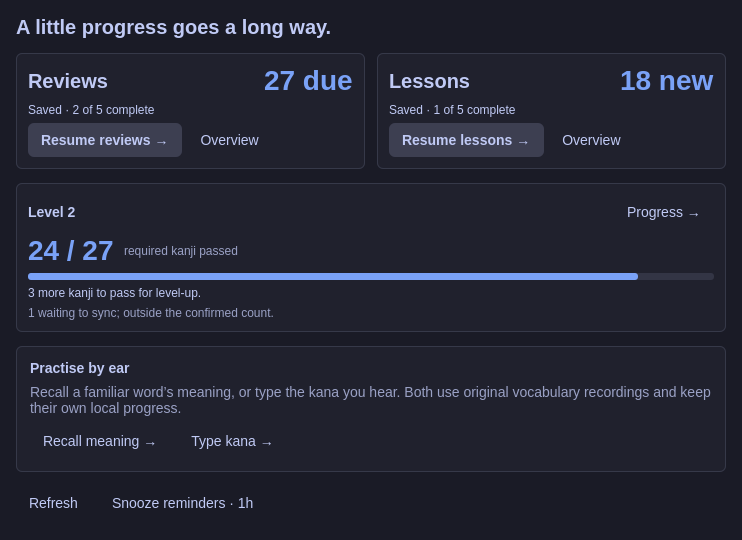

# WaniKani for Omarchy

**Five reviews, then back to work.**

A native WaniKani client for Omarchy: lessons, reviews, listening practice, offline study, selection lookup and an original crab companion. It follows your desktop theme and uses one shared Python worker behind the native QML interface. No browser wrapper, cloud backend, telemetry or AI grading.

**Version 0.2.14 is a development release.** This is an independent community client, not a Tofugu product. Live study and fourteen days of personal use remain qualification gates.



*Authored component preview with native controls and an authored Tokyo Night-style palette. The latest source still needs hosted desktop verification.* [More previews](docs/UI_TOUR.md)

## Install

Target: **Omarchy 4.0.2 / Quickshell 0.3.1**, Python 3.11+, Qt Multimedia and Noto Sans CJK JP. `wl-paste` supports explicit selection lookup; `secret-tool` supports optional keyring persistence.

This repository is currently local and unpublished. Install a committed checkout with:

```sh
omarchy plugin add /absolute/path/to/omarchy-wanikani --enable
```

Use the ordinary plugin manager for installation and updates. Keep the desktop fully unlocked and study closed during plugin lifecycle changes. This machine's [documented lock/reload incident](docs/LOCK_RELOAD_INCIDENT.md) has deferred installation of later milestones; [verified source and installed state](docs/IMPLEMENTATION.md) are recorded separately.

Click the crab in the bar, then choose **Try the demo** or **Settings → Account**. A WaniKani personal API token with read access supports dashboard and lookup. Native lessons/reviews also need assignment-start and review-create permissions; notes and synonyms need study-material create/update permissions. Credentials travel through private process pipes and can be stored in the desktop keyring. Session-only authentication is available when persistence is unavailable.

**Settings → Desktop → Install shortcuts & launchers** adds the available shortcuts and Study/Lookup launchers while preserving occupied bindings. The optional command-line equivalent is:

```sh
python3 tools/integrate.py check
python3 tools/integrate.py install
```

## How study works

| Choose | What happens |
| --- | --- |
| **Reviews** | Recall learned subjects in small batches. Lessons and reviews keep separate saved questions, drafts and mistake counts. |
| **Lessons** | Preview a batch, learn Meaning → Reading or Sound → Context, then explicitly start its quiz. |
| **Listen · Recall meaning** | Play a familiar recording, reveal the word, then choose Got it or Again. Local intervals and Undo stay separate from WaniKani. |
| **Listen · Type kana** | Transcribe the actual recording in romaji or kana. Check gives feedback; Continue records the local result. |
| **Progress** | See confirmed level passing, the level board, cross-level SRS subjects and separate account level visits. |
| **Activity** | Explore study and both audio skills recorded on this device. Cached seven-day totals also appear on Today. |
| **Lookup / Practice** | Search selected text locally, inspect a reading trail and choose up to twenty words for ungraded practice. |

**Enter** checks an answer, then acknowledges feedback. **Escape** saves and returns to work. Expand changes the view without restarting. **I made a typo** applies only to the current incorrect feedback before advancing; committed reviews cannot be retroactively changed.

Original vocabulary pronunciation has replay, named voices and explicit download/error states. **Settings → Audio** makes voice testing and autoplay choices visible. Meaning listening and kana dictation each keep a separate saved session and five-new-word daily allowance. Returning to saved audio practice stays silent.

Read the [user guide](docs/USER_GUIDE.md) for complete behavior, keyboard navigation, guided lessons, kanji audio examples, protected subject links, personal notes and saved-practice choices.

## Desktop behavior

- The bar shows due reviews, pending work or the next-review countdown.
- **Super+Alt+W** opens/resumes study; **Super+Alt+Shift+W** looks up selected text, falling back to the clipboard. Lookup reads text only when invoked.
- **Settings → Reminders** offers Study rhythm at chosen local times, at intervals or when reviews become available. Preview before applying. Quiet hours, shared limits, snooze, DND, lock and study suppression prevent notification backlogs.
- Optional learned-kanji cards and the Zen gallery follow the theme. Ambient views yield to activity, fullscreen, study, lock and the existing screensaver. Companion animation and reduced motion are independent settings.

**F1** opens keyboard help. [Desktop and reminder details](docs/USER_GUIDE.md#plan-desktop-study-breaks)

## Commands and agent support

```sh
omarchy-shell wanikani dashboard
omarchy-shell wanikani reviews
omarchy-shell wanikani lessons
omarchy-shell wanikani listen
omarchy-shell wanikani dictation
omarchy-shell wanikani lookup
```

For agents and scripts, use the bounded helper:

```sh
python3 tools/wanikani.py status --json
python3 tools/wanikani.py doctor --json
python3 tools/wanikani.py report --days 7 --json
```

Reports read cached seven/thirty-day aggregates and retain their calculation time, scope and stale/unknown status. They do not refresh the account, scan private answers or start study. See [all commands and IPC actions](docs/AGENT_SUPPORT.md) and the optional [agent playbook](skills/omarchy-wanikani/SKILL.md). The playbook is not registered globally by installation. Agents must not manufacture live answers or force uncertain submissions.

## Offline behavior and recovery

Cached lessons and due reviews work offline. Each answer is saved transactionally before advancing. Required subject text/images and optional recordings have separate availability indicators. Completed work stays pending until the server confirms it; pending subjects cannot enter another graded cycle.

A lost write response becomes **uncertain** and is never automatically replayed. Reconciliation respects changes made by another client. Saved submissions show waiting/conflicted work and an explicit **Keep remote & archive** action. [Recovery details](docs/USER_GUIDE.md#work-offline-and-recover-submissions)

## Your data

Private state lives under `${XDG_STATE_HOME:-~/.local/state}/omarchy/wanikani/`, with separate account and demo databases. Tokens are kept out of source, settings files, process arguments and diagnostics. Media is disposable; sessions, drafts and queued work are durable.

Settings provides disconnect, cache controls, redacted diagnostics and explicit local-data deletion. Deletion of unresolved work requires an additional acknowledgment. [Data and account controls](docs/USER_GUIDE.md#account-access-and-your-data)

## Update and remove

```sh
omarchy plugin update io.github.lostandadrift.wanikani
```

The development installation pulls committed changes from its local workspace origin. Keep study closed and the desktop fully unlocked. On the tested host, stale nested visuals sometimes require `omarchy restart shell` after an update; never use that as a recovery attempt while locked. See the [lock incident and upstream findings](docs/LOCK_UPSTREAM_RESEARCH.md).

Before removing the plugin, remove its optional integration from the installed directory:

```sh
python3 tools/integrate.py remove
omarchy plugin remove io.github.lostandadrift.wanikani
```

Only owned, unchanged launcher files and the marked binding block are removed. Account data remains until explicitly deleted.

## Development and release qualification

```sh
python3 tools/verify.py --revision HEAD
```

The [verifier](docs/VERIFICATION_RUNNER.md) exports an exact trusted Git tree to a private read-only archive and runs the Python, manifest, lint and core Qt checks. It writes a structured report without installing or reloading anything. Uncommitted changes are excluded. Automated tests use authored fixtures and mock APIs; WanaKana is bundled with its MIT notice and requires no npm installation.

See [test evidence](docs/VERIFICATION.md), [native QA](docs/NATIVE_QA.md), [architecture](docs/ARCHITECTURE.md), [the contest demonstration](docs/CONTEST_DEMO.md) and [future proposals](docs/NEXT_FEATURES.md). Audible Japanese, physical input, desktop lifecycle and the [fourteen-day daily-use gate](docs/DAILY_USE.md) still need qualification. No public repository or contest submission has been published.

## License

[MIT](LICENSE), with [WanaKana’s MIT notice](vendor/WanaKana.LICENSE) bundled locally. Original artwork and demonstration fixtures belong to this project; WaniKani account content belongs to its respective owners.
