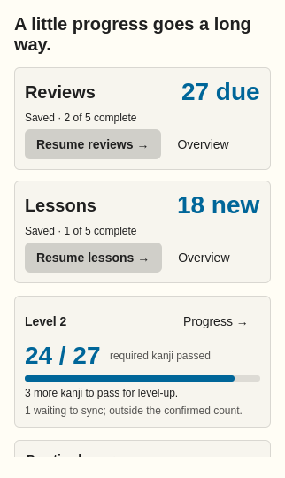
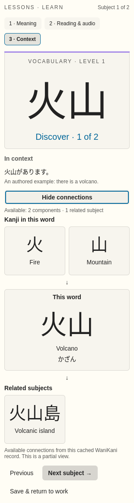
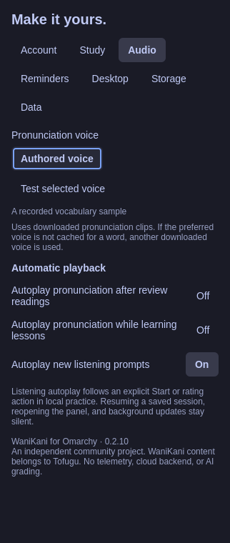
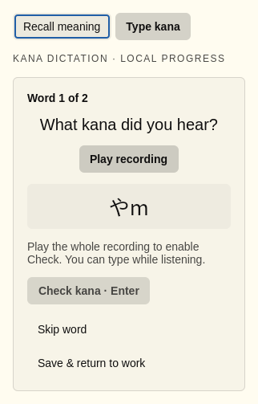
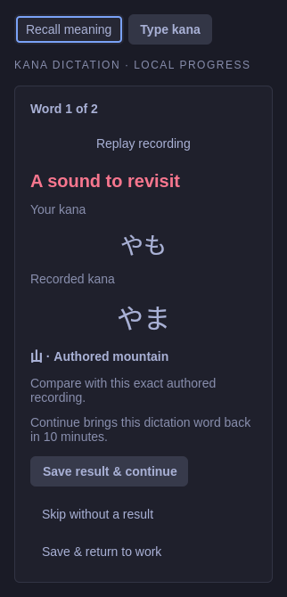
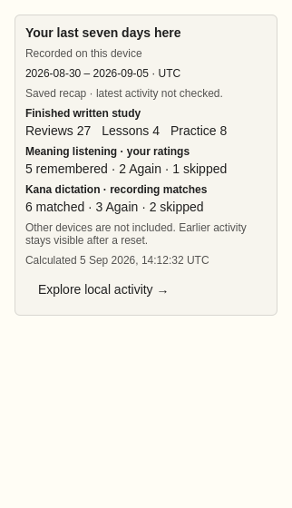
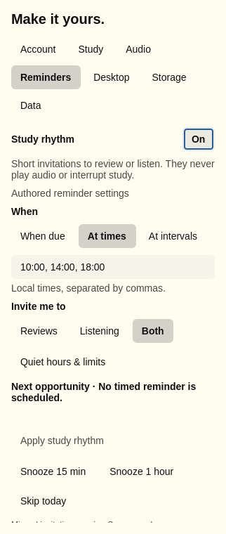

# A quick tour

These previews use independently authored sample data and the native controls in the **0.2.10 source**, with subject connections from **0.2.11**. They were rendered offscreen with inert account, audio and shell adapters. They show layout and interaction states; they are not photographs of the currently installed desktop or evidence of audible playback. Source and installed verification remain [separate](IMPLEMENTATION.md).

## Know what comes next

Today separates saved reviews from saved lessons, puts the confirmed level target beside them, and offers both audio activities. Pending work stays outside the confirmed passing count.

At a narrow width, the two study actions and level target still appear together:

## See how a word is built

Lesson Context can expand the cached connections without leaving its current step. Components lead to the current word and the related subjects supplied with it. This narrow authored example uses a partial cache record.

## Make pronunciation easy to find

Audio has its own Settings section, with a named voice, an explicit sample test and independent autoplay choices. Opening or leaving settings does not change these preferences.

## Learn from the sound

Type kana keeps the written word hidden while you listen and type. The example draft is deliberately unfinished. Playing the whole current recording enables checking; Continue commits a local result after feedback.

A missed transcription shows the learner's kana beside the actual recording's kana. Replay and Skip remain available. This changes local dictation practice, not WaniKani progress.

## See every kind of practice

Today's saved recap separates completed written study, meaning-listening self-ratings and kana-dictation matches. Skips remain visible separately. The date window and calculation time explain what the recap includes; open Activity for a current local report.

## Fit practice into the day

Study rhythm has a dedicated Reminders section. Choose opportunities and activity types, preview the result, then apply deliberately. This authored preview does not schedule anything on the host.

See the [user guide](USER_GUIDE.md) for the complete flows. Image hashes and capture scope are recorded in [component provenance](screenshots/component-provenance.json); exact qualification evidence is in [VERIFICATION.md](VERIFICATION.md). The new screens still need hosted input, audio, lock/suspend and personal daily-use qualification.
